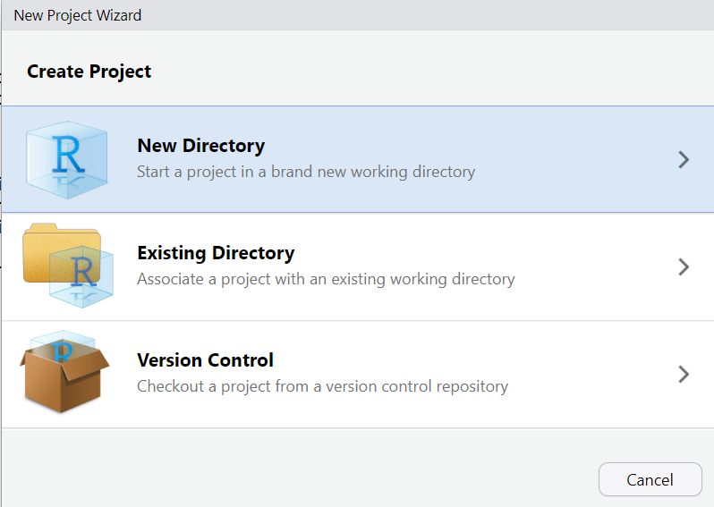
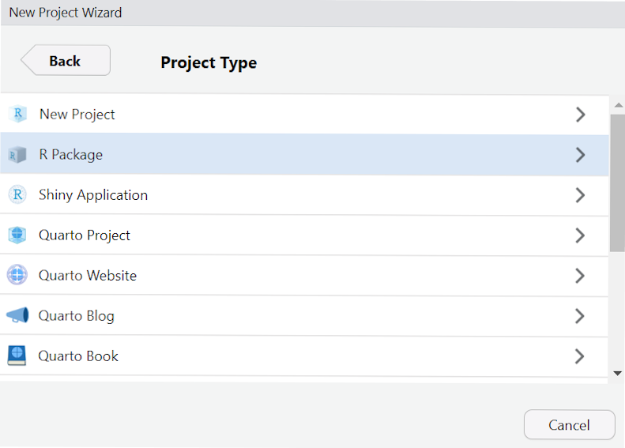
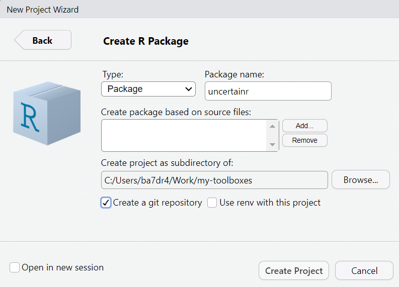
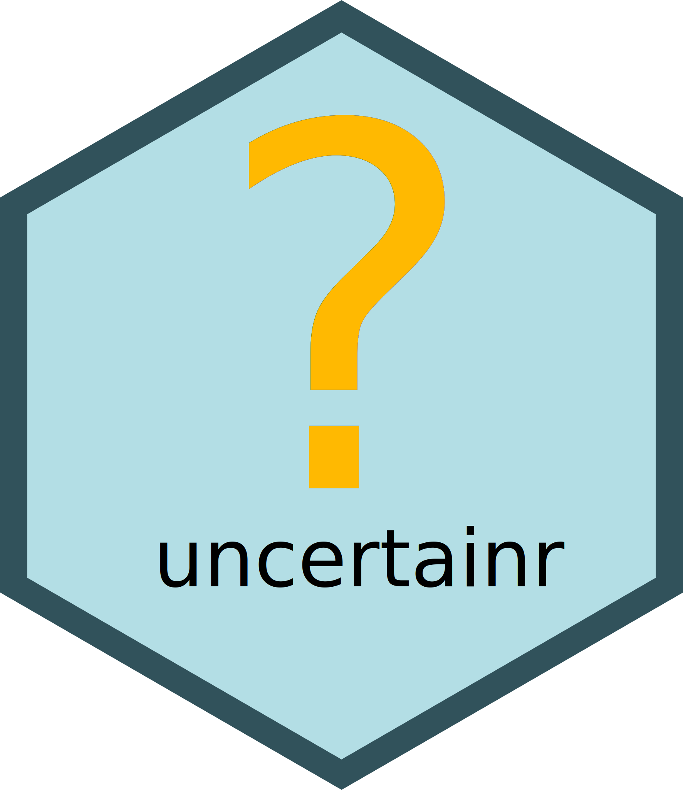

```{r, include = FALSE}
knitr::opts_chunk$set(
  collapse = TRUE,
  comment = "#>"
)
```

This is a walk through for creating a package in R. It is not meant to be exhaustive, as it leaves many optional features out. However, it is aimed to cover all the essential steps in package creation, so that at the end you will have a functional library you can extend.

## Prerequisites {-}

[R](https://cran.rstudio.com/) and [RStudio](https://posit.co/download/rstudio-desktop/), plus the following libraries, all available from CRAN:

* devtools
* usethis - various useful utilities that provide useful shortcuts
* roxygen2 - for generating documentation and configuration files from comments
* pkgdown - for typesetting and publishing documentation online

```r
install.packages(c("devtools", "usethis", "roxygen2", "pkgdown"))
```

## Creating a Blank Package Project

From the _File_ menu choose _New Project..._.

Next, choose _New Directory_:

{width=50%}

Then select _R Package_:

{width=50%}

In the next window, the most important choice you have to make is the name of your project. Ideally, it should be short and memorable. It should not be meaningful by itself. For example, in Hadley Wickham's _dplyr_ "The d is for dataframes, the plyr is to evoke pliers. Pronounce however you like." His package with utilities for factors is an anagram _forcats_. If you plan to submit your package to CRAN, it is a good idea to check whether the name is already taken by trying to install a package with this name via `install.packages("your_package_name")`.

Other choices are the root directory for your project folder (it would be created in your home folder by default) and whether to include git version control from the get go. You can always add it later, if you want, but keep in mind that both publishing online documentation and publishing your package on CRAN.

{width=50%}

You end up with the following folder structure:

*  .git
*  .Rproj.user
*  Man
  * hello.Rd
*  R
  * hello.R
* .gitignore
* .Rbiuldignore
* uncertainr.Rproj
* DESCRIPTION
* NAMESPACE

This is a minimal yet fully functional package with all necessary files. However, we do not need example code (**hello.R**) and documentation (**hello.Rd**), so delete them. In addition, the default configuration assumes that you write you documentation separately from code and that you maintain **NAMESPACE** file that provides declaration for all imports and exports for the package. The advantage of this method in having minimal dependencies other than _devtools_ package itself. However, it is far more practical to use docstrings to document your code and let _roxygen2_ take care of both documentation and **NAMESPACE**. We will add _roxygen2_ integration later and in the meantime delete **NAMESPACE** as well.

Files to delete:

* R/hello.R
* Man/hello.RD
* NAMESPACE

## Setting up Github integration
Conceptually, this is an optional step that can also perform at the very end. You can develop a package without a Github repository or even without git version control whatsoever. I would strongly recommend using git even if keeping things local, just for ability to branch and revert. But if you want others to use your package, publish your documentation at [github.io](https://pages.github.com) and publish your package on CRAN, you will need a public Github repository.

First, commit all files (I typically use "Blank project" or "Initial commit" as a comment). Then type
```r
usethis::use_github()
```
This will create a default branch for committed files (name _main_ by default), initialize the remote, add Github support to the **DESCRIPTION** file, and push your files to the remote.

Please note that to use Github you need to setup a github token first. For this, call
```r
usethis::create_github_token()
```
and follow prompt. Next, register your token with git via
```r
gitcreds::gitcreds_set()
```
Note that you’ll need to paste your token in the prompt.

## DESCRIPTION
Next, you need to update **DESCRIPTION** file replacing defaults. The fields you are concerned with are:

* Title : a single sentence description of your library in _Title Case_. If you are not sure what is a correct title case, simply run `stringr::str_to_title("Your package title")`.
* Authors@R : see below
* License : pick the one you like, in my case I have picker `GPL (>= 3)`.
* Date: put the current date. If you planning to submit to CRAN, your **DESCRIPTION** file _must_ have the _Date_ field and it _must_ be recent (I routinely forget to update it before submitting a new version to CRAN and get auto-rejected because of that).

The **Authors** description is very flexible, so I recommend reading [official documentation](https://cran.r-project.org/doc/manuals/R-exts.html#The-DESCRIPTION-file-1) on that. In my case, I am both the creator and the author, so the entry looks as follows:
```yaml
Authors@R:
  person(given = "Alexander",
         family = "Pastukhov",
         role = c("aut", "cre"),
         email ="pastukhov.alexander@gmail.com",
         comment = c(ORCID = "0000-0002-8738-8591"))
```

Here is my **DESCRIPTION** file after edits
```yaml
Package: uncertainr
Type: Package
Title: Collection of Functions To Characterize Uncertainty
Version: 0.1.0
Date: 2025-07-12
Authors@R:
  person(given = "Alexander",
         family = "Pastukhov",
         role = c("aut", "cre"),
         email ="pastukhov.alexander@gmail.com",
         comment = c(ORCID = "0000-0002-8738-8591"))
Description: Collection of functions to characterize uncertainty.
    Includes functions to compute percentile intervals for an emperical
    distribution.
License: GPL (>= 3)
Encoding: UTF-8
LazyData: true
```

## Adding roxygen2
Simply run
```r
roxygen2::roxygenise()
```
in the console. This will add `“RoxygenNote: 7.3.2”` to **DESCRIPTION** file (or whatever versoin of roxygen2 you have). Plus, it will (re)create **NAMESPACE** file with a message inside that you should not edit it by hand OR a warning that it is already present and that you should delete it (in that case, delete and rerun).

## Adding a first function
By this point, we have most of the scaffolding in place, so we can start writing the code. Our first function will be a simpler wrapper that computes a lower limit for a given percentile interval. For this, create a file **pi.R** (for Percentile Intervals) in **R** folder and copy-paste the following code:
```r
lower_pi <- function(values, CI = 0.97) {
  unname(stats::quantile(values, (1 - CI) / 2))
}
```

As you can see this is indeed a very simple wrapper around the `stats::quantile()` function. Please note two optional things. First, I use an explicit library reference. This is not required _in this case_ but IMHO makes it easier to keep track of external functions that you need to import in your package. Second, I wrap the call in `unname()` to remove names returned by `quantile()`. This does change the actual values and does not normally bother me, but it will interfere with unit testing later (something I have discovered while preparing this material).

## Adding docstring
It is extremely important to document the code and this is our next step. With text cursor in side the function, select _Code_ → _Insert Roxygen Skeleton_ from the top menu and this will create a template docstring in Roxygen format:
```r
#' Title
#’
#' @param values
#' @param CI 
#’
#' @returns
#' @export
#’
#' @examples
```

It is your job to fill it out. This is how I did it.
```r
#' Return lower boundary for the percentile interval
#‘
#' @param values Vector of numeric values
#' @param CI Float, confidence level. Default is `0.97`
#‘
#' @returns Float
#' @export
#‘ @importFrom stats quantile
#‘ 
#‘ @examples
#‘ lower_pi(norm(100))
```

Note that I have added `@importFrom stats quantile`. For every function that is _not_ in base R (which is why I do not import `unname()`), you need to explicitly declare the import. This information is then used by Roxygen to generate the **NAMESPACE** file. In contrast, the `@export` is added by default but you can remove it, if you want this function to be internal only and not available for an outside call.

Finally, one of the most import parts of documentation: examples. Each function that you write _must_ have examples, the more the merrier. Here, I have just one, but I should have included at least another example with a non-default CI, e.g., `lower_pi(rnorm(100), CI = 0.89)`.

Once you are done with the docstring, you need to run
```r
roxygen2::roxygenise()
```
in the console. This will update the **NAMESPACE** file adding import of `quantile` and export of `lower_pi` functions. It will also generated a documentation file for the function creating **lower_pi.Rd** in the **man** folder. Open it and click on _Preview_ button to see the documentation.

## Check your package
Now that we have the code, we need to check whether our package is a top order. Simply press _Check_ in the _Build_ tab (at the top right by default) or Ctrl+Shift+E on Windows and it will run a thorough check on the package, including the example. In our case, I deliberately made a typo writing `norm` instead of `rnorm` and that generated an error message shown below. This is a good thing, as it makes sure that all your examples work, but could be problematic if the computation takes too long. In this case, you can wrap the example in `\dontrun{}`, but use this sparingly.

```
❯ checking examples ... ERROR
  Running examples in 'uncertainr-Ex.R' failed
  The error most likely occurred in:
  
  > base::assign(".ptime", proc.time(), pos = "CheckExEnv")
  > ### Name: lower_pi
  > ### Title: Return lower boundary for the percentile interval
  > ### Aliases: lower_pi
  > 
  > ### ** Examples
  > 
  > lower_pi(norm(100))
  Error in norm(100) : 'A' must be a numeric matrix
  Calls: lower_pi -> unname -> <Anonymous> -> norm
  Execution halted

1 error ✖ | 0 warnings ✔ | 0 notes ✔
Error: R CMD check found ERRORs
Execution halted

Exited with status 1.
```

Fix the error adding "r" and **rerun the roxygen**! Yes, you need to explicitly run it every time you update your documentation.
```r
roxygen2::roxygenise()
```

## Tests
R has a checkered history when it comes to error and warning messages, so it is a good idea to check inputs yourself and fail as early as possible and with the clearest error message possible. As an example, we will check the validity of the `CI` parameter. On the one hand, we don't _need_ to do this, as the quantile function will fail and generate an error mesagge. On the other hand, it probably will not be immediatelly clear for a user that the problem is with the `lower_pi` function, so we should spare them time and effort discovering that. In general, more checks and earlier errors and warnings are better than silent defaults R is so fond of.

Here is the update code for the function that insures that `CI` is a single floating-point number:
```r
lower_pi <- function(values, CI = 0.97) {
  # Checking validity for CI value
  if (!(is.double(CI) && length(CI) == 1 && !is.na(CI) && CI>0.0 && CI<1.0)) {
    stop("`CI` must be a single floating-point (double) number in 0..1 range.")
  }

  unname(stats::quantile(values, (1 - CI) / 2))
}
```

Now, we can move on to one of the most important auxiliary components of a package: unit testing. When we write the code, we want to know that it correctly works and correctly _fails_. We could always run a few examples by hand to ensure this, but a better approach is create numerous tests that checks the consistency of behavior that can be run any time you modify the function and check the package (check also runs all the tests).

First, we need to create scaffolding for the tests via 
```r
usethis::use_testthat()
```
Now run the following line to create a test file called **tests/testthat/test-pi.R**
```r
usethis::use_test("pi")
```
Note that the file itself contains a generic test that has nothing to do with your own code, so we need to replace it. Here is my first test. I have change the name to match the functionality of our function and added the first test that checks that the returned value matches our expectations: lower limit for 0.9 interval for values from 0 to 20 is 1.
```r
test_that("lower boundary percentile works", { 
    expect_equal(lower_pi(0:20, CI=0.9), 1)
})
```
Run the test via _Test_ button in the _Build_ tab (or press Ctrl+Shift+T on Windows) which runs `devtools::test()` and you will see the results. Modify either the value for `CI` parameter or the expected value, re-run the test and you will see it fail. In real life scenario this would immediately alert you to the fact that your function is not working the way you thought it should.

This section started with us adding a check for validity of the `CI` parameter value, so we should also check that our function fails when it should. Here are the additional checks that now expect an error. This means that the test will fail, if the funciton does not. Given our restriction on the value of CI, I check that the funciton fails when it is out of range, it is the wrong type, or has multiple values. 
```r
test_that("lower boundary percentile works", { 
    expect_equal(lower_pi(0:20, CI=0.9), 1)

    # error is generated for invalid CI
    expect_error(lower_pi(rnorm(100), -1))
    expect_error(lower_pi(rnorm(100), "A"))
    expect_error(lower_pi(rnorm(100), c(0.7, 0.9)))
})
```
Again, run the test and check that it all green. Note that we could be adding more test and it is not uncommon, particularly in large projects, for the test code to have more lines than the actual code itself. So, do not spare your effort on tests (or documentation), it is a false economy.

## Second Function
To make our package a bit more complete, let us add a sister function that returns the _upper_ limit of the percentile interval. I put it in the same file, because they belong together, but you can also have one function per file, whatever makes it more logical.

```r
#' Return upper boundary for the percentile interval
#‘
#' @param values Vector of numeric values
#' @param CI Float, confidence level. Default is `0.97`
#‘
#' @returns Float
#' @export
#' @importFrom stats quantile
#‘
#' @examples
#' upper_pi(rnorm(100))
upper_pi <- function(values, CI = 0.97) {  
    # Checking validity for CI value
    if (!(is.double(CI) && length(CI) == 1 && !is.na(CI) && CI>0.0 && CI<1.0)) {
        stop("`CI` must be a single floating-point (double) number in 0..1 range.")
    }
   unname(stats::quantile(values, 1 - (1 - CI) / 2))
}
```

Since we have another function, we should add tests for it in **tests/testthat/test-pi.R**:
```r
test_that(“upper boundary percentile works", { 
    expect_equal(upper_pi(0:20, CI=0.9), 19)

    # error is generated for invalid CI
    expect_error(upper_pi(rnorm(100), -1))
    expect_error(upper_pi(rnorm(100), "A"))
    expect_error(upper_pi(rnorm(100), c(0.7, 0.9)))
})
```

## Example data
One of the important components of an R package is the data that can be used in examples and the user can load via `data()` function. In typical cases, this is an actual data that you either obtained from an open source or your own data that you are willing to share. In this case, we will simply generate normally distributed values.
```r
standard_normal <- data.frame(Value = rnorm(100))
```

Now that the data frame is in the global environment, we can turn it into example data set via 
```r
usethis::use_data(standard_normal)
```
This creates a folder **data** and saves the table into **standard_normal.rda**. Now you can load it via `data(standard_normal)`.

However, we are not done! Remember, the package lives and dies by its documentation, so we need to document the example data set as well. For this, we need to create a new _source_ file **R/data.R** that will be parsed by roxygen. This file should contain descriptions for all data sets in the following format:
```r
#‘ Title
#'
#‘ Description
#‘ Multiline if needed.
#'
#' @format
#' A data frame with N rows and M columns:
#' \describe{
#'   \item{Column 1}{Column description}
#'   \item{Column M}{Column description}
#' }
#' @source <https:///>
"table_name"
```
Here is an example of the data set description from a different package:
```r
#' Art has the power to stretch the boundaries of moral behaviour
#'
#' A subset of data from the "Art has the power to stretch the boundaries of moral behaviour"
#' manuscript.
#'
#' @format
#' A data frame with 25,400 rows and 6 columns:
#' \describe{
#'   \item{Group}{Experimental group, factor with three levels: "NonArt-Online", "Art-Online", and "Art-Gallery"}
#'   \item{ID}{Participant ID}
#'   \item{Response}{Response on a 7-point Likert scale}
#'   \item{PaintingKind}{Factor with two levels: "Moral" or "Immoral"}
#'   \item{PaintingID}{ID of individual paintings}
#'   \item{Scale}{Questionnaire scale, factor with 10 levels}
#' }
#' @source <https://osf.io/zf476/>
"art"
```

And here is the description for the table in our package:
```r
#' Standard normally distributed values
#’
#' Table with normally distributed values
#' with mean = 0 and standard deviation = 1.
#’
#' @format
#' A data frame with 100 rows and 1 column:
#' \describe{
#'   \item{Value}{Normally distributed values.}
#’ }
"standard_normal"
```
Do not forget to `roxeginize` your documentation, once you are done writing the docstring.

## More Documentation: README
So far, we have neglected the **README** file, which is extremely important, as this is what others see when they are looking at repository. Minimally, it should contain information about the purpose of the package, how to install and use it. Here is my take on this:

````
# uncertainr
Collection of Functions To Characterize Uncertainty. Includes functions to compute percentile intervals for an empirical distribution.

## Installation
To install from CRAN
``` r
install.packages("installr")
```
To install from github
``` r 
library("devtools")
install_github("alexander-pastukhov/installr", dependencies=TRUE)
```
## Usage
``` r
library(installr)
lower_pi(rnorm(100))
```
````

## Even More Documentation: Vignettes
It is a very good idea to include vignettes into your documentation: articles that explain certain functionality or concepts behind the computation at length and in depth. To create a vignette run
```r
usethis::use_vignette("percentile-intervals")
```
This will create a file **percentile-intervals.Rmd** in **vignettes** folder, which you edit and knit directly. Here is a simple vignette that I have created. This is way to short to be useful as an actual vignette, but that stems from the limited nature of our package. In real-life scenario, packages often have a series of connected functions that perform computation, summarize, and plot the results, and a vignette is a perfect place to show the entire pipeline startin with data preparation to plotting the final result.

---

````
---
title: "Percentile intervals"
output: rmarkdown::html_vignette
vignette: >
  %\VignetteIndexEntry{Percentile intervals}
  %\VignetteEngine{knitr::rmarkdown}
  %\VignetteEncoding{UTF-8}
---

```{r setup}
library(uncertainr)
```

Basic usage
```{r}
standard_normal <- rnorm(100)
c(lower_pi(standard_normal), upper_pi(standard_normal))
```

Custom interval
```{r}
lower_pi(standard_normal, 0.89)
```
````
---

Please note that if you are installing the package locally (which you can do via _Clean and Install_ button in the _Build_ tab), by default, the vignettes are not included. Hence, you need to explicitly whish for them:
```r
devtools::install(build_vignettes = TRUE)
```

## Creating Public Documentation
The advantage of doing a proper documentation from the get go is that you need a minimal effort to turn it into public documentation available via gitpages. The package that does the job is [pkgdown](https://pkgdown.r-lib.org/), which takes README and turns it into the front page, puts all vignettes as articles, and documentation for all functions into a reference page. Here is the link to the documentation for this package: [alexander-pastukhov.github.io/uncertainr](https://alexander-pastukhov.github.io/uncertainr/).

To set it up, call
```r
usethis::use_pkgdown_github_pages()
```
This will create configuration, creating branch gh-pages and associated workflows. Once you update your documentation locally, you can update it at gitpages via 

```r
pkgdown::deploy_to_branch()
```

## Preparing for CRAN
If you want to publish your package on [CRAN], you need to first run _Check_ and make sure there are no errors and warnings. You are allowed to have notes but only if you can explain why the underlying issue is essential to the package, e.g., use of GNU compiler. Otherwise, resolve the issue that generates the note. Once you are ready click on _Build Source Package_. This will create **uncertainr_0.1.0.tar.gz** file.

Once you have that file and are pretty confident that you didn't miss anything, you go to the official [submission page](https://cran.r-project.org/submit.html), fill out the information and attach the file. The only non-trivial field here is _Optinonal comments_. Use them if you need to explain unavoidable NOTES in the check. On the next page, the form fields will populated from the **DESCRIPTION** file, so it a good point to check that it is up to date (including the _Date_ field!). Once you submit, you get an email with a link to confirm the submission. Some time later (typically within the same day), a CRAN maintainer will run automatic check and you get an email with issues that you need to fix. For some reason, their automatic check is more thorough than the ones you ran, so it might catch some additional issues (such as the data or title case for the title). Do not get discouraged, just fix the issue, resubmit, get response, fix again, etc. Eventually, you will get a message that your package is on the way to CRAN!

## Cherry on top: Hex Sticker
R has a tradition of hex stickers for packages.


You can design your own using hexSticker package or by hand. Here is a sticker I designed for this package:

{width=10%}

## Creating a DOI for your package
If you want people to cite your package even without a paper (more on that below), you can create the Digital Object Identifier for each release. For this, head to [zenodo.org](https://zenodo.org/), create an account, and follow the instructions. You will need to give Zenodo access to your Github account, so it can automate DOI generation for each release. You can decide which repositories it watches. As a nice visual bonus, you get a nice DOI badge you can easily embed in your README, e.g.:

[](https://doi.org/10.5281/zenodo.14535613)

## Publishing A Paper On Your Package
You probably want credit and recognition for the work you have done, so it is a good idea to publish a paper on it. Where some obvious choice, such as [Behavior Research Methods
](https://www.psychonomic.org/page/brm). Perhaps less known options are the [Journal of Statistical Software](https://www.jstatsoft.org/index) and [Journal of Open Source Software](https://joss.theoj.org/). The philosophy of the latter is that you already did a lot by writing the package, so creating a paper should be as little of hurdle as possible. Hence, you can just take your vignettes as section, put together some intro and outro and submit. The submission and reviewing process is unusual and cool. Your submission is just a branch in your Github repository and the reviewer literally raises issues that you respond to (and if you are lucky, they might even make a pull request). I had a very positive experience as both an author and a reviewer, so this is definitely a very interesting option.

## Additional Resources 
The aim of this walk through was to cover all important topics that I feel are a part of a minimal package. You can build on this foundation and create more complex packages that use classes and formulas, include C or Stan code, etc. The sky is the limit. Here are some useful resources to help with your future endeavors:

* [Writing R Extensions](https://cran.r-project.org/doc/manuals/R-exts.html)
* [Writing packages from Posit](https://docs.posit.co/ide/user/ide/guide/pkg-devel/writing-packages.html)
* [Advanced R](https://adv-r.hadley.nz/)

